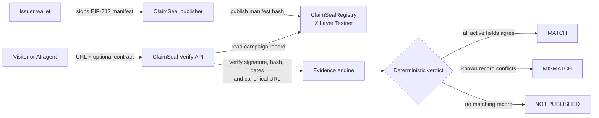
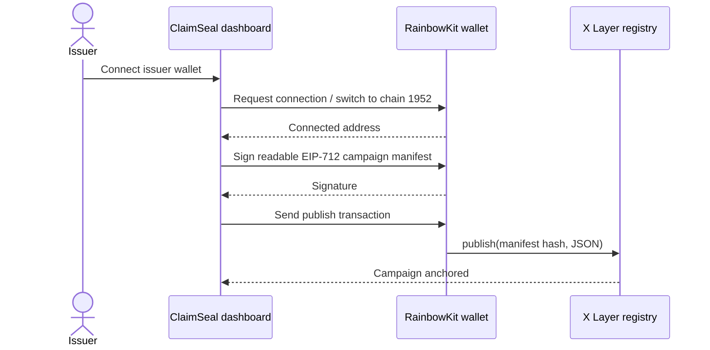

# ClaimSeal

[](https://github.com/NikhilRaikwar/ClaimSeal/actions/workflows/ci.yml)
[](https://web3.okx.com/onchainos/dev-docs/xlayer/developer/build-on-xlayer/network-information)
[](https://web3.okx.com/xlayer/build-x-series)
[](https://vercel.com/docs/analytics)

> **Verify a claim before you connect.** ClaimSeal is a public, read-only verifier for token-claim, mint, migration, and bridge campaign records.

An issuer signs a human-readable EIP-712 manifest that binds an official HTTPS URL, an optional contract address, and a validity window. ClaimSeal anchors the manifest hash in an X Layer Testnet registry, then returns an explainable verification result to a visitor or agent — **without asking the verifier to connect a wallet**.

## Why it matters

Campaign links are routinely copied, shortened, and impersonated. ClaimSeal gives launch teams a cryptographic source of truth for their official campaign details and gives users a fast answer before they connect a wallet or take action.

| Product fact             | Value                                        |
| ------------------------ | -------------------------------------------- |
| Primary Build X category | Software Utility / Software Services         |
| Network                  | X Layer Testnet (`chainId: 1952`)            |
| Registry                 | `0x3ed839ea78e7bff4c06ed93110987e7083533d6b` |
| Agent service            | `POST /v1/verify-claim-manifest`             |
| Verdicts                 | `MATCH`, `MISMATCH`, `NOT_PUBLISHED`         |
| Verifier wallet          | Never required                               |

## How it works



### Issuer flow



## Features

- Public verification with no wallet connection, token approval, or custody.
- Issuer-only campaign publishing, revision, and revocation.
- RainbowKit + Wagmi wallet flow with automatic dashboard redirect after connection.
- EIP-712 issuer signatures, canonical URL matching, manifest hash checks, onchain issuer checks, validity checks, and revision checks.
- A clean evidence card for every verdict instead of an unexplained “safe” label.
- A free A2MCP-compatible HTTP service for the OKX.AI marketplace.
- Privacy-safe Vercel Web Analytics: page-view query strings and fragments are removed before events are sent.

## Trust boundaries

ClaimSeal verifies an issuer-signed campaign record. It does **not** audit smart contracts, inspect token economics, guarantee that a website is safe, execute a transaction, or collect private keys.

| Verdict         | Meaning                                                                                                |
| --------------- | ------------------------------------------------------------------------------------------------------ |
| `MATCH`         | The supplied fields agree with an active, issuer-signed ClaimSeal record.                              |
| `MISMATCH`      | A known record conflicts with supplied fields, is inactive, revoked, expired, or has invalid evidence. |
| `NOT_PUBLISHED` | No matching ClaimSeal record was found; this is not a safety assessment.                               |

## Local development

### Prerequisites

- Node.js 22+
- A browser wallet for issuer testing
- Testnet-only OKB for the issuer/deployer wallet
- A public WalletConnect project ID for mobile/QR connections

### Install and configure

```sh
npm ci
cp .env.example .env.local
npm run contract:compile
npm run dev
```

Set the deployment values in `.env.local`. Never commit `DEPLOYER_PRIVATE_KEY` or a copied `.env` file. Full configuration and deployment steps are in [TESTNET_DEPLOYMENT.md](./TESTNET_DEPLOYMENT.md).

## API

### `POST /v1/verify-claim-manifest`

```json
{
  "url": "https://campaign.example/testnet-claim",
  "claimContract": "0x0000000000000000000000000000000000000000",
  "campaignId": "0x..."
}
```

The response contains a verdict and field-level evidence for the normalized URL, contract, EIP-712 signature, active validity window, and X Layer registry anchor.

```sh
curl -X POST "$CLAIMSEAL_BASE_URL/v1/verify-claim-manifest" \
  -H "content-type: application/json" \
  -d '{"url":"https://campaign.example/testnet-claim"}'
```

## Quality checks

```sh
npm run lint
npm run contract:compile
npm run build
npm run api:smoke
```

The CI workflow runs linting, registry compilation, and a production build on every push and pull request.

## Project structure

```text
contracts/                 ClaimSealRegistry Solidity contract
scripts/                   Compile, deploy, and API smoke scripts
src/lib/                   Protocol, wallet, registry, and verifier logic
src/routes/                Public verifier, issuer, and HTTP API routes
src/components/            Evidence, passport, and shared UI components
TESTNET_DEPLOYMENT.md      Safe testnet and ASP handoff guide
```

## Build X submission checklist

- [ ] Publish a real, clearly labelled testnet demo campaign.
- [ ] Test `MATCH`, typo-domain `MISMATCH`, and `NOT_PUBLISHED` end-to-end.
- [ ] Deploy the web/API service on a public HTTPS domain.
- [ ] Register ClaimSeal Verify as a free A2MCP ASP and wait for the marketplace listing to be live.
- [ ] Record an X demo under 90 seconds and include `#OKXAI`.
- [ ] Submit the live ASP URL and X-post URL through the Build X Google Form.

## Useful commands

```sh
npm run dev
npm run lint
npm run build
npm run contract:compile
npm run contract:deploy:testnet
npm run api:smoke
```

## Security

Use a dedicated testnet wallet for deployments and demos. Never use real assets, a mainnet wallet, seed phrase, or private key. The project deliberately treats absent registry/RPC configuration as an error rather than returning a made-up verification verdict.
