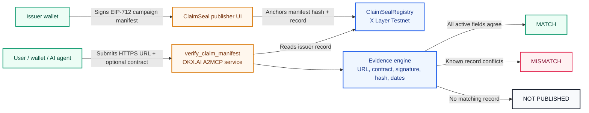
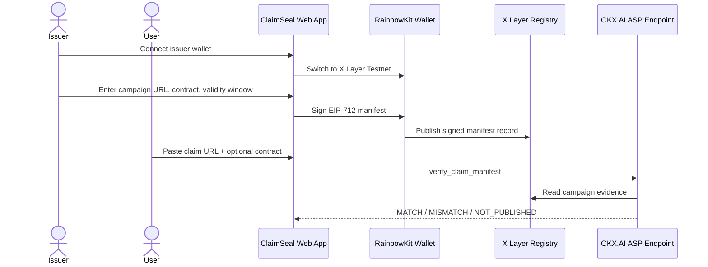

# ClaimSeal

[](https://claimseal.vercel.app)
[](https://www.okx.ai)
[](https://www.okx.com/web3/explorer/xlayer-test)
[](./LICENSE)

> Verify a claim before you connect.

ClaimSeal is a public verifier and OKX.AI Agent Service Provider that checks whether a token-claim campaign URL and optional claim contract match an issuer-signed record anchored on X Layer Testnet.

Users and agents get a simple verdict before trusting a claim link:

- `MATCH` — the checked URL and contract match the active issuer-signed record.
- `MISMATCH` — a known campaign record exists, but one or more checked fields differ.
- `NOT_PUBLISHED` — no matching ClaimSeal record was found.

## Live links

| Item                     | Link / value                                                                                                                                     |
| ------------------------ | ------------------------------------------------------------------------------------------------------------------------------------------------ |
| Live app                 | [claimseal.vercel.app](https://claimseal.vercel.app)                                                                                             |
| OKX.AI ASP               | `ClaimSeal`                                                                                                                                      |
| Agent ID                 | `9234`                                                                                                                                           |
| ASP type                 | `A2MCP`                                                                                                                                          |
| Free service             | `verify_claim_manifest`                                                                                                                          |
| API endpoint             | [`POST /v1/verify-claim-manifest`](https://claimseal.vercel.app/v1/verify-claim-manifest)                                                        |
| X Layer Testnet registry | [`0x3ed839Ea78e7BFF4c06ED93110987E7083533d6b`](https://www.okx.com/web3/explorer/xlayer-test/address/0x3ed839Ea78e7BFF4c06ED93110987E7083533d6b) |
| Chain                    | X Layer Testnet, `chainId: 1952`                                                                                                                 |

## Why ClaimSeal exists

Fake claim links and typo domains are hard for users to judge quickly. A phishing page can copy a campaign design, swap a contract, and pressure users to connect a wallet.

ClaimSeal gives campaign issuers a signed source of truth and gives users, wallets, and AI agents a fast read-only check before any wallet interaction.

## Build X / OKX.AI fit

ClaimSeal targets the OKX.AI Genesis Hackathon requirement directly:

- It is a practical ASP that solves a clear real-world use case.
- It is listed as an OKX.AI Agent Service Provider.
- It exposes a free A2MCP-style HTTP service for agent-native verification.
- It is live on X Layer Testnet with a public registry and real verification flow.
- It is strongest for the `Software Utility` / `Software Services` category.

## Architecture



## Product flow



## What gets verified

| Evidence                        | Why it matters                                                     |
| ------------------------------- | ------------------------------------------------------------------ |
| Canonical HTTPS host and path   | Catches typo domains and copied phishing pages.                    |
| Optional claim contract address | Catches swapped or malicious claim contracts.                      |
| Issuer wallet                   | Confirms the campaign came from the expected signer.               |
| EIP-712 signature               | Proves the issuer signed the manifest contents.                    |
| Manifest hash                   | Proves the displayed JSON matches the anchored record.             |
| Validity window                 | Prevents expired or not-yet-active campaigns from appearing valid. |
| Revocation status               | Lets issuers pull a stale or compromised campaign record.          |

## API

### `POST /v1/verify-claim-manifest`

Request:

```json
{
  "url": "https://claimseal.vercel.app/verify",
  "claimContract": "0x3ed839Ea78e7BFF4c06ED93110987E7083533d6b",
  "campaignId": "0x..."
}
```

`claimContract` and `campaignId` are optional. At least a HTTPS `url` is required.

Response shape:

```json
{
  "verdict": "MATCH",
  "campaign": {
    "name": "ClaimSeal Testnet Verification Demo",
    "issuer": "0x...",
    "chainId": 1952
  },
  "checks": [
    {
      "field": "canonicalUrl",
      "status": "match",
      "expected": "claimseal.vercel.app/verify",
      "actual": "claimseal.vercel.app/verify"
    }
  ]
}
```

Example:

```sh
curl -X POST "https://claimseal.vercel.app/v1/verify-claim-manifest" \
  -H "content-type: application/json" \
  -d '{"url":"https://claimseal.vercel.app/verify"}'
```

## Submission checklist

- [x] Live product deployed on HTTPS.
- [x] Public social preview image configured: [`public/claimseal-social-banner.png`](./public/claimseal-social-banner.png).
- [x] X Layer Testnet registry deployed.
- [x] Issuer dashboard and publish flow built.
- [x] Public verifier supports `MATCH`, `MISMATCH`, and `NOT_PUBLISHED`.
- [x] Free OKX.AI A2MCP service endpoint built.
- [x] ClaimSeal ASP reviewed and listed on OKX.AI.
- [x] Agent ID available: `9234`.
- [ ] Record and post 90-second X demo with `#OKXAI`.
- [ ] Submit the Google Form with ASP details and X post link before July 27, 2026, 23:59 UTC.

## Local development

### Requirements

- Node.js 22+
- npm
- Browser wallet for issuer testing
- X Layer Testnet OKB for deploy/publish transactions
- WalletConnect project ID for RainbowKit

### Setup

```sh
npm ci
cp .env.example .env.local
npm run contract:compile
npm run dev
```

### Environment

Copy `.env.example` to `.env.local` and configure:

```env
VITE_WALLETCONNECT_PROJECT_ID=
VITE_CLAIMSEAL_REGISTRY_ADDRESS=
VITE_XLAYER_TESTNET_RPC_URL=
DEPLOYER_PRIVATE_KEY=
```

Never commit `.env`, `.env.local`, private keys, seed phrases, or real-wallet secrets.

### Quality checks

```sh
npm run lint
npm run contract:compile
npm run build
npm run api:smoke
```

## Project structure

```text
contracts/                 ClaimSealRegistry Solidity contract
scripts/                   Compile, deploy, and API smoke scripts
src/components/            Passport card, evidence table, header, UI components
src/lib/                   Protocol, registry, wallet, verifier, API helpers
src/routes/                Web pages and HTTP API routes
public/                    ClaimSeal brand and social preview assets
TESTNET_DEPLOYMENT.md      X Layer deployment and demo guide
```

## Security boundaries

ClaimSeal verifies that submitted campaign details match an issuer-signed record. It does not:

- audit website code,
- audit smart contracts,
- guarantee campaign safety,
- approve token transfers,
- custody user funds,
- ask public verifiers to connect a wallet.

For demos and testing, use dedicated testnet wallets only.

## License

MIT © 2026 Nikhil Raikwar. See [LICENSE](./LICENSE).
